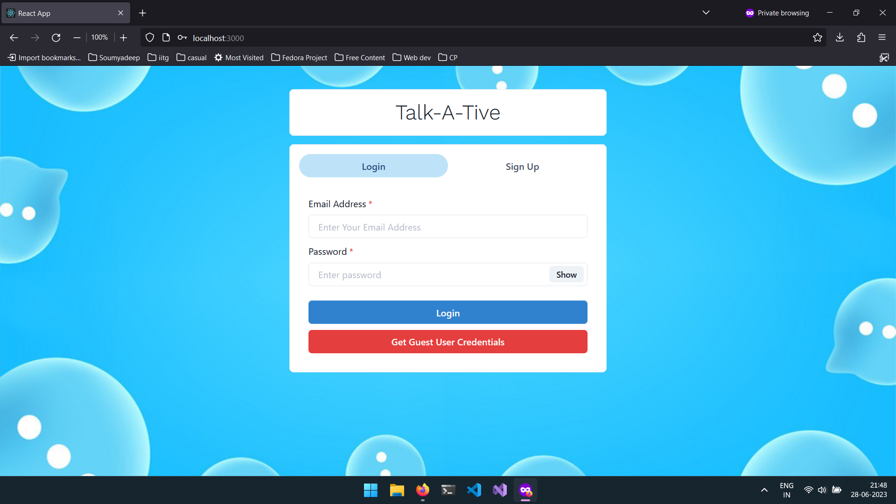
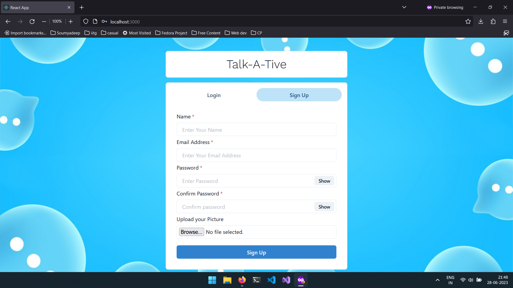
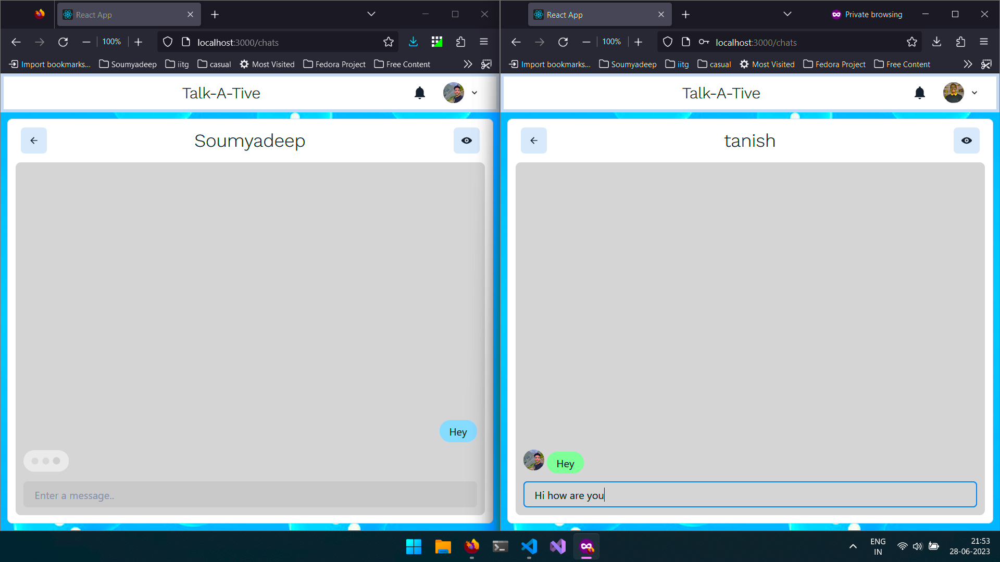
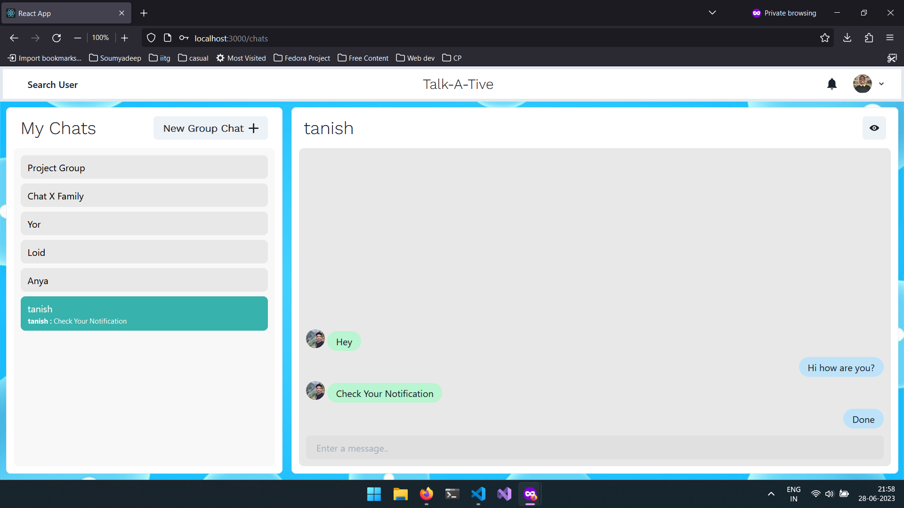
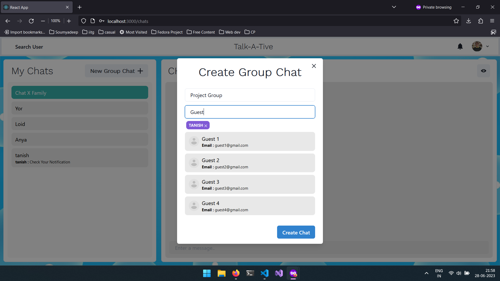
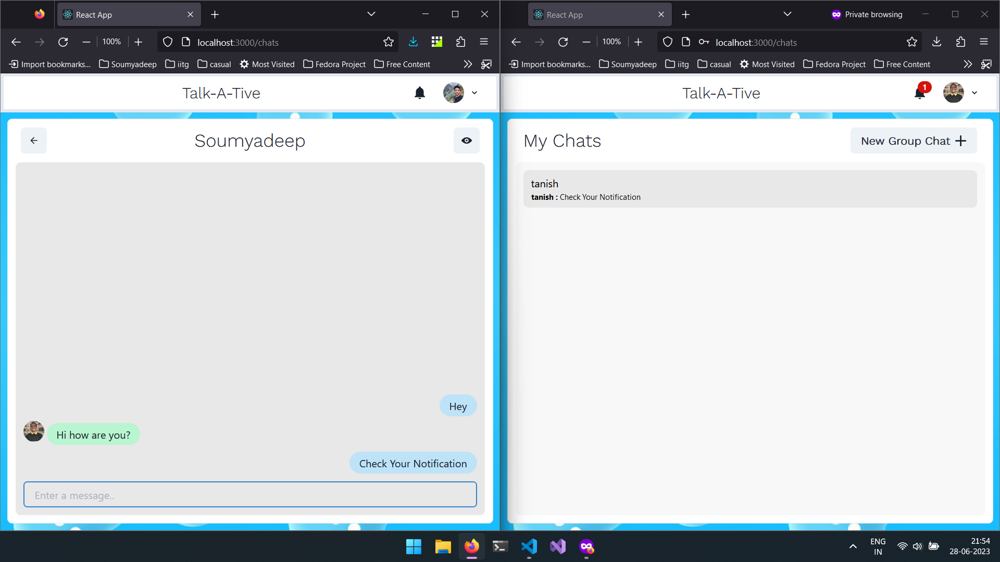
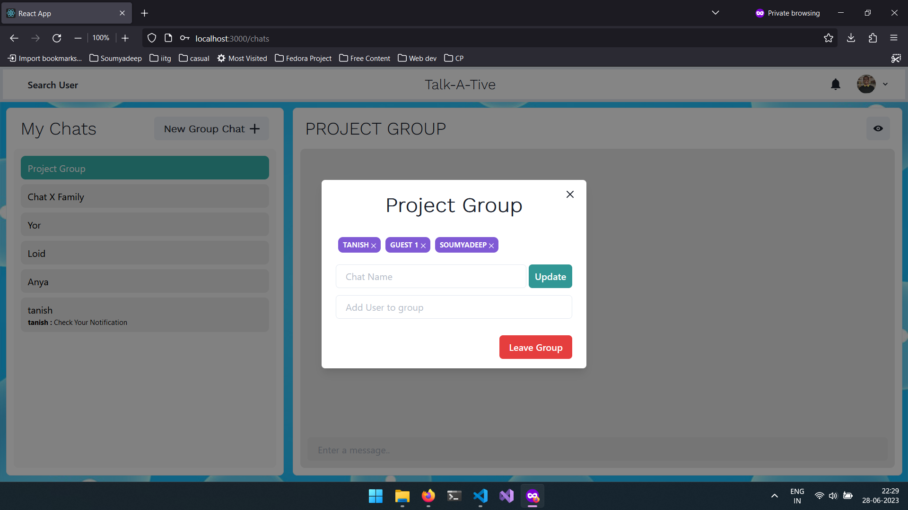
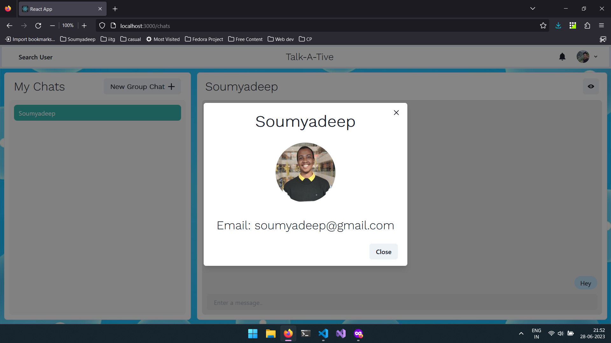

# Talk-A-Tive

This project is made as a learning project.
Talk-a-tive is a Full Stack Real Time Chatting App.
It uses Socket.io for real time communication and stores user details in encrypted format in Mongo DB Database.
## Tech Stack

**Client:** React JS

**Server:** Node JS, Express JS

**Database:** Mongo DB
  

## Run Locally

Clone the project

```bash
  git clone https://github.com/v-tanish012/Real-Time-Chat-App.git
```

Go to the project directory

```bash
  cd Real-Time-Chat-App
```

Install dependencies

```bash
  npm install
```

```bash
  cd frontend/
  npm install
```

Start the server

```bash
  npm run start
```
Start the Client

```bash
  //open now terminal
  cd frontend
  npm start
```

  
# Features

### Authenticaton


### Real Time Chatting with Typing indicators

### One to One chat

### Search Users

### Create Group Chats

### Notifications 

### Add or Remove users from group

### View Other user Profile

## Acknowledgements

- [Piyush-eon](https://www.youtube.com/playlist?list=PLKhlp2qtUcSZsGkxAdgnPcHioRr-4guZf) for Youtube tutorial on making the chat app

  